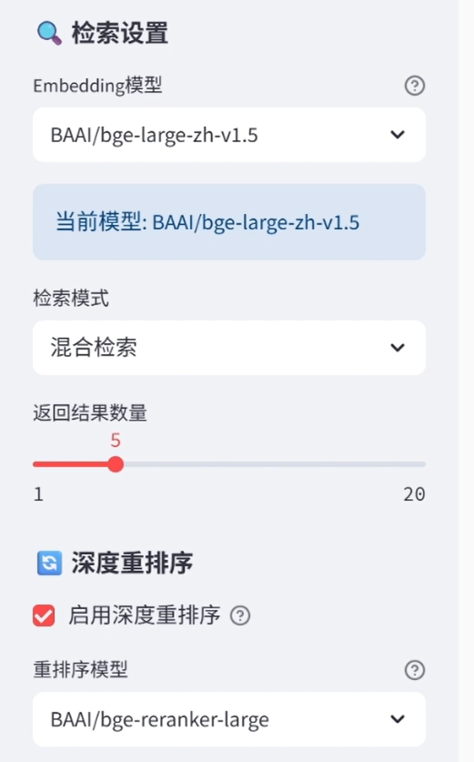

# 📜 古文智能问答系统

基于RAG技术的古典文献智能问答系统，支持论语、孟子、史记等各种古文的语义检索和智能问答。

## ✨ 主要功能

- **智能检索**: BM25关键词 + 向量语义混合检索
- **AI问答**: 支持DeepSeek、智谱GLM等API进行智能回答
- **多种界面**: Streamlit Web界面 + 后端API + 前端页面
- **数据处理**: 自动分块、话题分类、上下文提取


## 📁 项目结构

```
├── 📁 streamlit/             # Streamlit版本
│   ├── 📄 app.py             # 主应用入口
│   ├── 📄 config.py          # 配置管理
│   ├── 📄 models.py          # 数据模型
│   ├── 📄 rag_system.py      # RAG核心系统
│   ├── 📄 retrieval.py       # 检索器实现
│   ├── 📄 text_processing.py # 文本处理
│   ├── 📄 api_client.py      # API客户端
│   └── 📄 rag_client.py      # RAG客户端库
├── 📁 backend/               # 后端API版本
├── 📄 index.html            # 前端界面
```


## 🚀 环境配置

### 安装依赖

```bash
# 基础依赖
pip install torch==2.7.0
pip install sentence-transformers
pip install streamlit chromadb pandas numpy jieba

# 可选依赖（推荐安装）
pip install rank-bm25                    # BM25检索
pip install sentence-transformers torch  # 向量计算和重排序
pip install zhipuai                      # 智谱GLM API
```

### 数据准备

按以下结构组织古文数据：

```
data/
├── 论语/
│   ├── 学而/
│   │   └── text.txt
│   └── 为政/
│       └── text.txt
├── 孟子/
│   └── 梁惠王上/
│       └── text.txt
└── 史记/
    └── 项羽本纪/
        └── text.txt
```

文本文件内容示例：

```
学而时习之，不亦说乎？
有朋自远方来，不亦乐乎？
人不知而不愠，不亦君子乎？
```

## 📖 使用方法

### 1. Streamlit Web界面

```bash
cd streamlit
streamlit run app.py
```

访问 http://localhost:8501

**使用步骤**：

1. 在侧边栏配置数据目录路径
2. 配置AI API密钥（可选）
3. 点击"加载古文数据"
4. 在主界面输入问题进行检索

### 2. 后端API

```bash
cd backend
python api_server.py  # 启动API服务
```

### 3. 前端页面

直接打开 `index.html` 文件

## 🔧 配置说明

### API配置

在Streamlit侧边栏配置：

**DeepSeek API**:

```
API Provider: DeepSeek
API Key: your-deepseek-api-key
```

**智谱GLM API**:

```
API Provider: GLM
API Key: your-glm-api-key
```


### 检索参数

- **检索模式**: 混合检索（推荐）/ 向量检索 / 关键词检索
- **返回数量**: 1-20个结果
- **重排序**: 可选启用BGE重排序模型




## 💡 使用示例

### 基础查询

```
问题: "什么是仁？"
系统会自动搜索相关古文并生成智能回答
```

### 指定范围查询

```
指定书名: "论语"
指定篇章: "学而"
问题: "学习的方法"
```

### 智能检索
- 配置大模型API
- 勾选 智能查询优化
  


### 多轮检索
- 配置大模型API
- 勾选 启用多轮检索


### 后端API调用示例

```python
from rag_client import RAGClient

# 创建客户端
client = RAGClient("http://localhost:8000")

# 智能搜索
response = client.smart_search("如何修身养性", top_k=5)
print(response.results[0].content)

# 直接搜索
response = client.direct_search(
    "什么是仁", 
    bm25_weight=0.3, 
    vector_weight=0.7
)
```


## ⚠️ 注意事项

1. **首次运行**需要下载embedding模型，可能需要一些时间
2. **GPU推荐**但非必需，CPU也可以运行
3. **API密钥**是可选的，不配置也可以进行基础检索
4. **数据量**较大时建议使用8GB以上内存
