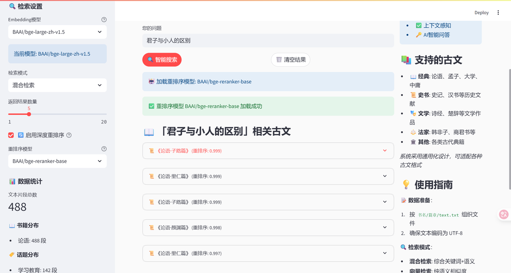

# nlp2025_group_4 JingLun AI(经纶通识)

## 基本框架的界面，已经实现了完整的大模型调用服务（index.html）
可以直接通过链接方案https://buptnlp.github.io/nlp2025_group_4/

可用deepseel API： sk-6b732d64cf7f440491f187fa82e89a2d

## 目前的rag测试界面（guyu.py）

